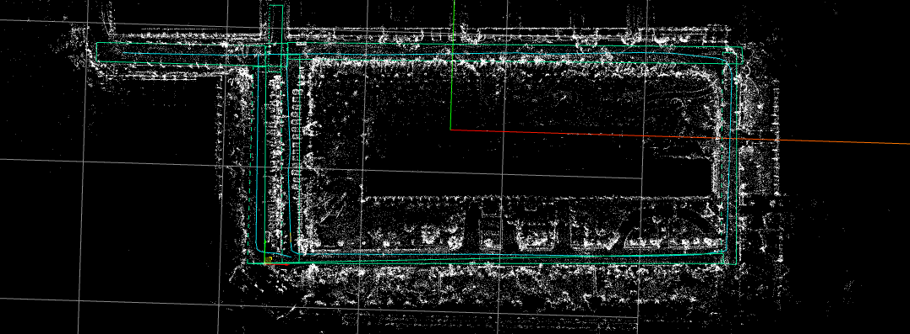
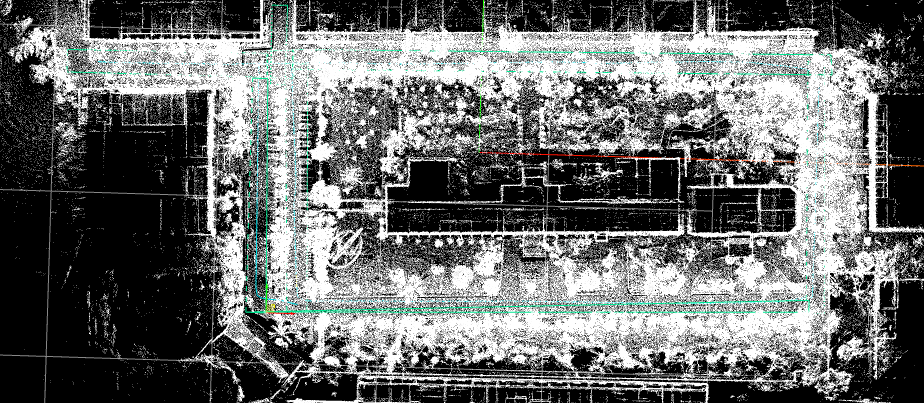
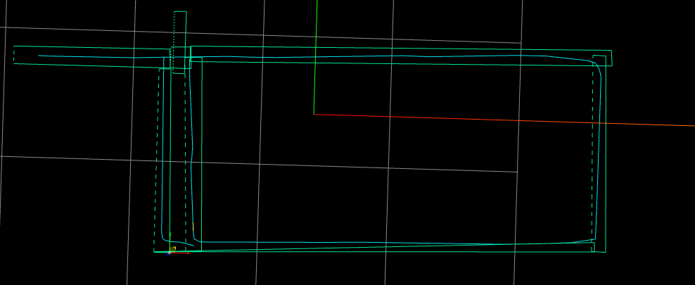
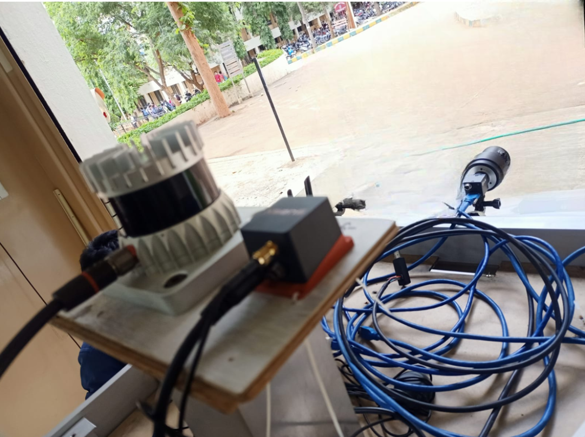
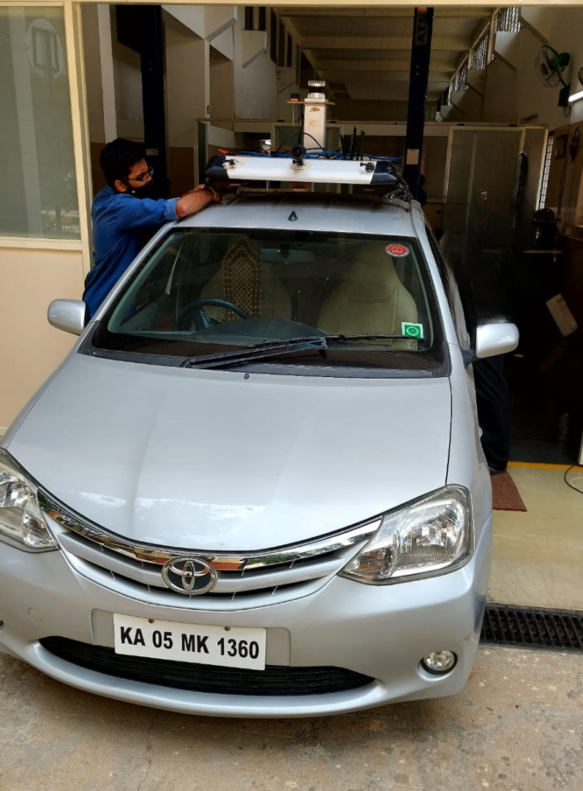

# LiDAR-Based Localization and Mapping (LIO-SAM)

A ROS-based simultaneous localization and mapping (SLAM) system using LiDAR, IMU, and GPS sensors to generate high-definition maps with real-time pose estimation.

## Overview

This project implements a complete SLAM pipeline that fuses LiDAR point cloud data with inertial measurement unit (IMU) readings and optional GPS information to create accurate localization and high-definition maps. The system is designed to work with various LiDAR sensors including Ouster, Velodyne, and Livox.

## Project Structure

```
Localization_and_mapping/
├── src/
│   ├── featureExtraction.cpp      # LiDAR feature extraction (corners, surfaces)
│   ├── imageProjection.cpp         # Point cloud projection and range image generation
│   ├── imuPreintegration.cpp       # IMU factor preintegration for odometry
│   ├── mapOptmization.cpp          # Backend optimization and loop closure
│   ├── params.yaml                 # Configuration parameters
│   └── utility.h                   # Utility functions and type definitions
└── README.md
```

## Features

- **Multi-Sensor Fusion**: Combines LiDAR, IMU, and GPS for robust SLAM
- **Feature-Based Mapping**: Extracts corner and planar surface features from point clouds
- **Real-Time Odometry**: Fast odometry estimation using IMU preintegration
- **Loop Closure Detection**: Detects and corrects for revisited locations
- **Flexible Sensor Support**: Compatible with Ouster, Velodyne, and Livox LiDAR sensors
- **High-Definition Maps**: Generates detailed 3D maps with surface and corner features
- **ROS Integration**: Fully integrated with ROS ecosystem for easy deployment

## Requirements

### Dependencies

- **ROS** (Melodic or Noetic recommended)
- **PCL** (Point Cloud Library)
- **OpenCV**
- **Eigen**
- **Ceres Solver** (for optimization)

### Hardware

- LiDAR sensor (Ouster, Velodyne, or Livox)
- IMU sensor
- Optional: GPS receiver

## Installation

1. Clone the repository into your ROS workspace:
   ```bash
   cd ~/catkin_ws/src
   git clone https://github.com/VivekRnx/Localization_and_mapping.git
   ```

2. Build the project:
   ```bash
   cd ~/catkin_ws
   catkin_make
   ```

3. Source the setup file:
   ```bash
   source devel/setup.bash
   ```

## Configuration

The `params.yaml` file contains all configurable parameters:

### Key Parameters

- **Sensor Type**: Set `sensor` to `ouster`, `velodyne`, or `livox`
- **LiDAR Channels**: Configure `N_SCAN` (e.g., 64 for Ouster, 32 for Velodyne)
- **Horizontal Resolution**: Set `Horizon_SCAN` based on sensor specs
- **Downsampling**: Adjust `downsampleRate` for performance tuning
- **GPS Settings**: Enable/disable GPS fusion as needed
- **Frame Mapping**: Define coordinate frames for your system

See `src/params.yaml` for complete parameter documentation.

## System Architecture

The SLAM system consists of four main components:

1. **Feature Extraction** (`featureExtraction.cpp`)
   - Extracts corner and planar features from raw point clouds
   - Identifies distinctive geometric patterns for robust tracking

2. **Image Projection** (`imageProjection.cpp`)
   - Projects point clouds onto range images
   - Organizes points for efficient feature extraction

3. **IMU Preintegration** (`imuPreintegration.cpp`)
   - Integrates IMU measurements between key frames
   - Provides fast odometry estimates

4. **Map Optimization** (`mapOptmization.cpp`)
   - Backend graph optimization
   - Loop closure detection and correction
   - Final map and trajectory refinement

## Results

### HD Map with Corner Features


### HD Map with Surface Features


### HD Map with Annotations


### System Setup



## Demo

For a detailed demonstration of the system in action, watch the [ROS Run Video](https://drive.google.com/file/d/1rEQZTX_GTZ7F0xulWyYVEPFnvxEI_5BN/view?usp=drive_link).

## License

This project is part of the LIO-SAM framework. Please refer to the original repository for license information. 
